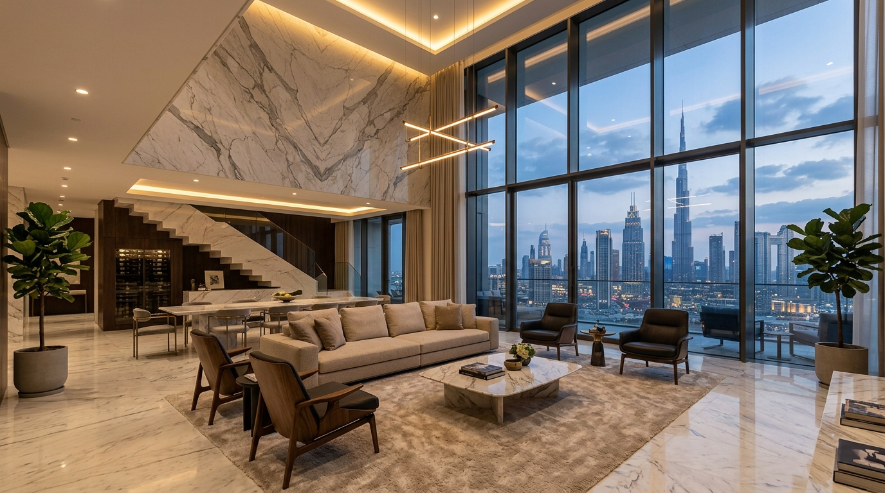

# Guia de Integração Técnica - Dubai Site 2 (WordPress & Elementor)

Este documento descreve o procedimento passo a passo em **português (Brasil)** para que os desenvolvedores e programadores repliquem e portem a estrutura, recursos visuais, interações e o chaveador de temas (Dark/Light mode) do site estático **Dubai Incorporadora** para o **WordPress** utilizando o **Elementor Builder**.

---

## Passo 1: Injeção do Tailwind CSS e Fontes no Cabeçalho

O design premium do site utiliza classes utilitárias do Tailwind CSS combinadas com fontes específicas do Google Fonts.

1. Acesse o arquivo `header.php` do seu tema ou use um plugin de injeção de scripts (como *Header and Footer Code Manager*).
2. Adicione as seguintes tags dentro da seção `<head>`:

```html
<!-- Google Fonts (Playfair Display para títulos serifados e Outfit para textos) -->
<link rel="preconnect" href="https://fonts.googleapis.com">
<link rel="preconnect" href="https://fonts.gstatic.com" crossorigin>
<link href="https://fonts.googleapis.com/css2?family=Outfit:wght@200;300;400;500;600;700;800&family=Playfair+Display:ital,wght@0,400;0,600;0,700;1,400&display=swap" rel="stylesheet">

<!-- Tailwind CSS Play-Cdn -->
<script src="https://cdn.tailwindcss.com"></script>
```

---

## Passo 2: Importação dos Estilos Globais (`assets/style.css`)

Todos os estilos personalizados de luxo, animações de scroll, efeito *glassmorphism* (vidro fosco), reflexo nos cards, transições da linha do tempo e correções de contraste do modo claro estão centralizados no arquivo:
👉 `assets/style.css`

**Instruções de Importação:**
1. Copie todo o conteúdo do arquivo `assets/style.css`.
2. No painel do WordPress, cole o código em **Aparência > Personalizar > CSS Adicional** ou insira diretamente nas configurações de CSS Global do **Elementor Pro**.

---

## Passo 3: Script de Interatividade (`assets/main.js`)

A interatividade premium (efeito 3D tilt nos cards, comportamento dinâmico do cabeçalho ao rolar a página, carregamento dinâmico dos detalhes do projeto por parâmetro de URL, abertura do menu drawer desktop/mobile e chaveamento de tema) está no arquivo:
👉 `assets/main.js`

**Como implementar:**
1. Faça o upload do arquivo `main.js` para o diretório de assets do seu tema WordPress.
2. Enfileire o script no arquivo `functions.php` do tema para garantir o carregamento correto no rodapé:
   ```php
   function enqueue_dubai_scripts() {
       wp_enqueue_script('dubai-main-js', get_template_directory_uri() . '/assets/main.js', array(), '1.1', true);
   }
   add_action('wp_enqueue_scripts', 'enqueue_dubai_scripts');
   ```
3. *Alternativa Elementor:* Cole o código de `assets/main.js` em um bloco de código personalizado (Elementor Custom Code) configurado para carregar no rodapé (Footer) com tag `<script>`.

---

## Passo 4: Estruturação das Páginas no Elementor

Para as páginas estáticas (`index.html`, `quem-somos.html`, `empreendimentos.html`, `contato.html`, `d-concept.html`, `politicas-de-privacidade.html` e `termos-e-condicoes-de-uso.html`):

1. Crie uma nova página no WordPress para cada arquivo HTML.
2. Defina o modelo de página como **Elementor Canvas** para obter uma tela limpa sem cabeçalhos/rodapés legados do tema.
3. Adicione o widget **HTML** do Elementor.
4. Abra o respectivo arquivo HTML estático, copie todo o código de estrutura contido na página e cole no widget HTML.

### ⚠️ CRÍTICO: Caminho de Mídias (Imagens e Vídeos)
Os caminhos originais nos arquivos HTML são locais (ex: `src="assets/dconcept-cozinha.jpg"`).
1. Faça o upload de todas as mídias da pasta `assets/` para a **Biblioteca de Mídia do WordPress**.
2. Substitua os caminhos relativos das tags ``, `<video>` ou estilos inline pelas **URLs completas e absolutas** fornecidas pela biblioteca do WordPress.
   * *Exemplo de substituição:*
     ```html
     <!-- De: -->
     
     <!-- Para: -->
     
     ```

---

## Passo 5: Cabeçalho Dinâmico e Drawer Menu Unificado

O cabeçalho foi unificado e corrigido. Ele possui duas variantes controladas dinamicamente via JS na rolagem (`updateHeaderScroll`):
* **Modo Escuro (Padrão):** Fundo transparente, letras e ícones brancos.
* **Modo Claro (Ativado via chaveador ou rolagem):** Fundo translúcido branco (`header.header-light`), letras e caminhos SVG escuros.

### Menu Lateral Desktop & Mobile
* **Desktop Drawer Menu (`#header-menu-opened`):** Gerado programmaticamente em `assets/main.js` para garantir consistência. Adiciona o botão `d.concept` e redireciona os cliques. Possui correções que mantêm o texto legível e as transições de hover funcionando perfeitamente em modo claro.
* **Mobile Drawer Menu (`#mobile-menu`):** Adaptado para o modo claro com fundo glassmorphism claro (`rgba(247, 247, 249, 0.98)`), bordas suaves e transições em vermelho no hover. O texto não fica oculto.

---

## Passo 6: Integração da Página d.concept (`d-concept.html`)

Esta página introduz a personalização de alto padrão da incorporadora com recursos visuais excepcionais.

### 1. Lista de Mídias Necessárias (Upload para a Biblioteca):
* `dconcept-hero.jpg` (Banner principal)
* `dconcept-fase1.jpg` (Aba do cronograma - Fase 1)
* `dconcept-fase2.jpg` (Aba do cronograma - Fase 2)
* `dconcept-cozinha.jpg` (Galeria - Cozinha Gourmet)
* `dconcept-quarto.jpg` (Galeria - Suíte Master)
* `dconcept-office.jpg` (Galeria - Home Office)
* `dconcept-banheiro.jpg` (Galeria - Banheiro Spa)
* `dconcept-sala.jpg` (Galeria - Living Contemporâneo)
* `dconcept-closet.jpg` (Galeria - Walk-in Closet)

### 2. Efeitos Visuais Habilitados por CSS e JS:
* **Efeito 3D Tilt nos Cards:** Os elementos com a classe `interactive-tilt` sofrem inclinação conforme o mouse se move sobre eles. Certifique-se de que a estrutura HTML de cada card do cronograma e galeria mantenha essa classe.
* **Efeito Ken Burns nas Imagens da Galeria:** As imagens da galeria de inspirações d.concept contam com zoom suave de aproximação no hover, definido nativamente pelas seguintes regras no CSS:
  ```css
  .gallery-card img {
    transition: transform 0.7s cubic-bezier(0.16, 1, 0.3, 1) !important;
  }
  .gallery-card:hover img {
    transform: scale(1.1) !important;
  }
  ```
* **Contraste de Botões Vermelhos e Badges no Modo Claro:** Para evitar que o texto dos botões ativos e badges circulares com fundo vermelho `#d81d00` fique escuro ou ilegível em modo claro, utilize as classes de alta prioridade `.text-white-forced` e `.dconcept-badge` que forçam o texto a permanecer em branco:
  ```css
  .light-mode .text-white-forced {
    color: #ffffff !important;
  }
  .light-mode .dconcept-badge {
    background-color: #d81d00 !important;
    color: #ffffff !important;
  }
  ```

---

## Passo 7: Dinamização com Custom Post Types (Recomendado)

Embora o site estático utilize o array `empreendimentosData` em `assets/main.js` para renderizar os dados e especificações em `detalhe.html`, a melhor prática no WordPress para produção é dinamizar os empreendimentos:

1. Instale o plugin gratuito **ACF (Advanced Custom Fields)** e crie os seguintes campos:
   * Área mínima e máxima (Ex: `95m² a 130m²`)
   * Número de dormitórios/suítes (Ex: `3 Dormitórios`)
   * Status do Empreendimento (Lançamento, Em Obras, Pronto)
   * Galeria de Imagens das plantas e progresso das obras.
2. Crie um modelo de página única para o Post Type no **Elementor Pro Theme Builder** e mapeie os elementos HTML para exibir os valores dinamicamente.
